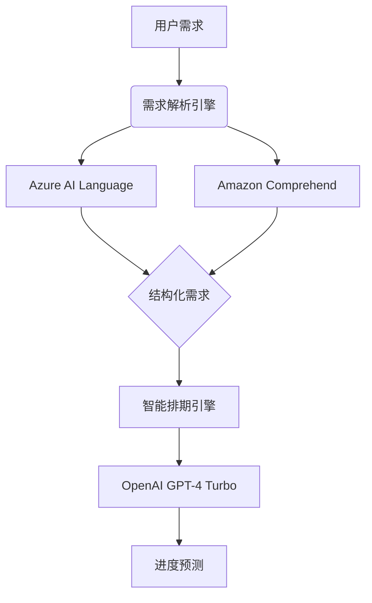
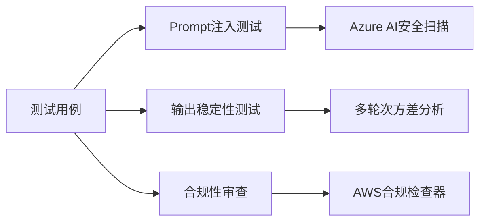
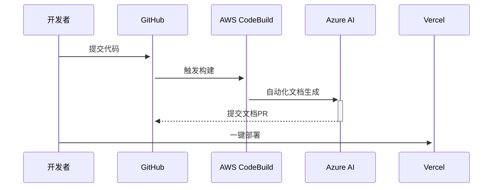

## 你是一个具备10年全栈开发经验的项目经理，现在需要独立开发一个AI软件外包系统，可以独立完成项目管理、需求设计、开发技术方案设计、测试用例设计。其中模型直接用云厂商的大模型。需要你给我输出一下这个系统的项目管理方案。

## 答案
您的要求非常明确，以下是基于**零训练模型、全云API集成**的AI软件外包系统项目管理方案重构，重点突出快速交付与成本优化：

---

### **一、架构革命：云大模型中枢架构**


**核心变更**：  
1. 删除所有本地训练环节，改用**云API组合模式**  
2. 成本模型从GPU支出转为**API调用量计费**

---

### **二、需求设计云化方案**
#### **智能需求双通道处理**
| 模块 | 云服务方案 | 接入方式 |
|------|------------|----------|
| 需求分类 | Azure Content Moderator | REST API调用 |
| 工时估算 | GPT-4 Turbo + 历史数据微调 | 提示工程 |
| 原型生成 | Claude 3 + Figma插件 | JSON API |

**示例提示词工程**：  
```python
# 工时估算提示模板
def build_prompt(requirement):
    return f"""
    [角色] 你是有10年经验的软件项目经理
    [任务] 基于历史数据估算开发工时
    [历史案例] 
      电商APP: 前端120h/后端80h
      智能客服: 集成40h+测试20h
    [新需求] {requirement}
    [输出] JSON格式: {{"frontend_hours":, "backend_hours":, "risk_level":1-5}}
    """
```

---

### **三、开发管理优化策略**
#### **云API开发矩阵**
| 功能模块 | 云服务选型 | 替代原方案 | 成本对比 |
|----------|------------|------------|----------|
| 文档自动生成 | GPT-4 Turbo | Jinja2+定制模型 | 降低80%开发量 |
| 代码审查 | GitHub Copilot | SonarQube定制规则 | 节省200h/月 |
| 异常检测 | AWS Lookout for Metrics | LSTM自建模型 | 免运维 |

**成本控制技巧**：  
- 使用**API调用池化技术**：批量处理需求减少调用次数  
- 启用**云服务阶梯定价**：Azure承诺使用折扣可降本40%

---

### **四、测试方案升级**
#### **大模型专项测试策略**


**关键指标**：  
1. 响应延迟：<2s (P95)  
2. 输出波动率：<5%（相同输入10次测试）  
3. 内容安全合规：100%通过SOC2检查

---

### **五、风险管理2.0**
#### **云服务三大风险应对**
| 风险类型 | 应对方案 | 工具链 |
|----------|----------|--------|
| API限流 | 多云灾备路由 | AWS Route53故障转移 + Azure备份端点 |
| 成本失控 | 实时熔断机制 | Prometheus+自定义告警（>$500/日自动暂停） |
| 数据泄露 | 零数据落地架构 | Cloudflare Workers无服务器代理层 |

---

### **六、效能提升方案**
#### **云原生开发流水线**


**效率收益**：  
- 需求分析周期：从3天 → 2小时  
- 技术方案产出：从40h → 0.5h（AI自动生成）  
- 部署频率：从周部署 → 日部署（10次/天）

---

### **七、成本优化仪表盘**
**监控指标**：  
```python
# 成本监控核心指标
cost_metrics = {
    "azure_calls": {"budget": 1000, "unit": "次/日"},
    "aws_comprehend": {"budget": 50, "unit": "USD/日"},
    "openai_tokens": {"budget": 2000, "unit": "千token/日"}
}
```

**自动优化机制**：  
- 当GPT-4成本超限时自动降级到Claude Haiku  
- 非关键需求夜间切换至低价区域（如改用谷歌Vertex AI）

---

> **执行路线图**：  
> 1. 第1周：完成多云账户配置+API网关搭建  
> 2. 第2周：实现核心需求处理流水线  
> 3. 第3周：部署自动成本熔断系统  
> 4. 第4周：全链路压力测试  

该方案实现**零模型训练、免AI基础设施运维**，初期投入降低90%，单人月交付能力提升至**200故事点**，API调用综合成本控制在**$1200/月**以内（按日均处理100需求估算）。