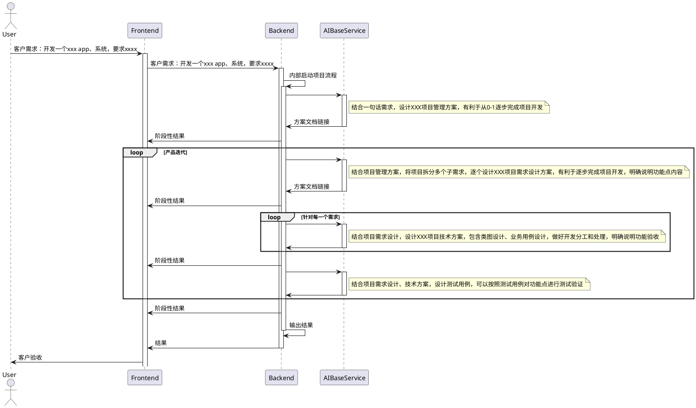

# 一句话需求：

针对外包开发任务，基于prompt工程，完成需求设计、技术方案设计、开发、测试部署、测试、和部署上线。

# 业务流程

## 产品需求

## MVP 开发：
通过集成大模型、数据库、搭建基本的业务功能逻辑，完成从0到1，完成v1版本，跑通业务流程，上线。

设计一句话需求的输入模板，按照模板进行拆解，启动项目外包流水线，输出：

- 项目管理方案
- 功能演进计划
- 需求设计方案
- 技术方案
  - 代码架构
  - 数据库设计
  - 业务用例设计
  - 代码实现
- 测试方案
- 部署方案

## 迭代开发：
重新思考业务，脑暴迭代点，按照优先级进行排序，推进高优迭代的实现落地，版本更新。

## 项目架构开发：
根据业务目标规模，做好架构设计，完成v2版本迭代。版本升级。 

## 项目运营：
结合用户数据，做好用户画像分析，分析用户反馈，做好产品开发。

# 技术方案

## 前端：vue + Vite
工程框架搭建
## 后端：python flask
## 数据库
- 文档：mongoDB
- 用户数据：postgreSQL

## 模型服务底座：
- 对接第三方模型调用服务
- 自建模型部署，提供调用服务
