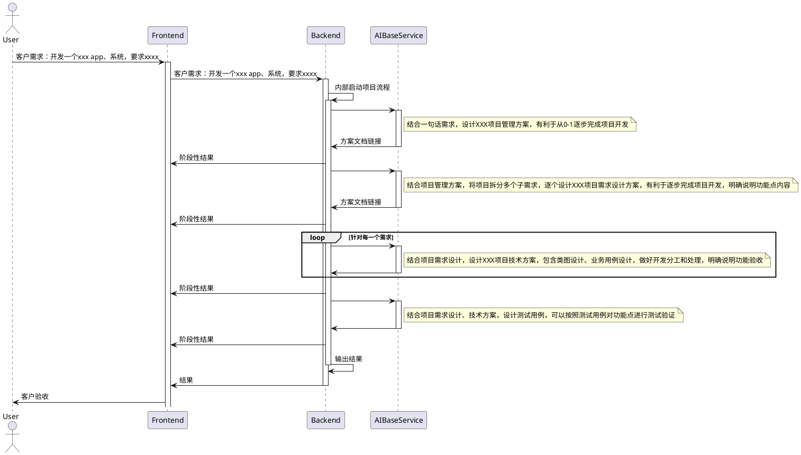

# 一句话需求：

针对外包开发任务，基于prompt工程，完成需求设计、技术方案设计、开发、测试部署、测试、和部署上线。

# 业务流程

```plantuml
@startuml
actor User
User -> Frontend++ : 客户需求：开发一个xxx app、系统，要求xxxx

Frontend -> Backend++: 客户需求：开发一个xxx app、系统，要求xxxx
Backend -> Backend++: 内部启动项目流程
Backend -> AIBaseService++
note right of AIBaseService: 结合一句话需求，设计XXX项目管理方案，有利于从0-1逐步完成项目开发
AIBaseService -> Backend--: 方案文档链接
Backend -> Frontend: 阶段性结果
Backend -> AIBaseService++:
note right of AIBaseService: 结合项目管理方案，将项目拆分多个子需求，逐个设计XXX项目需求设计方案，有利于逐步完成项目开发，明确说明功能点内容
AIBaseService -> Backend--: 方案文档链接
Backend -> Frontend: 阶段性结果
loop 针对每一个需求
    Backend -> AIBaseService++
    note right of AIBaseService: 结合项目需求设计，设计XXX项目技术方案，包含类图设计、业务用例设计，做好开发分工和处理，明确说明功能验收
    AIBaseService -> Backend--: 
end
Backend -> Frontend: 阶段性结果
Backend -> AIBaseService++
note right of AIBaseService: 结合项目需求设计、技术方案，设计测试用例，可以按照测试用例对功能点进行测试验证

AIBaseService -> Backend--: 
Backend -> Frontend: 阶段性结果

Backend -> Backend--: 输出结果

Backend -> Frontend--: 结果

Frontend -> User : 客户验收
@enduml

```