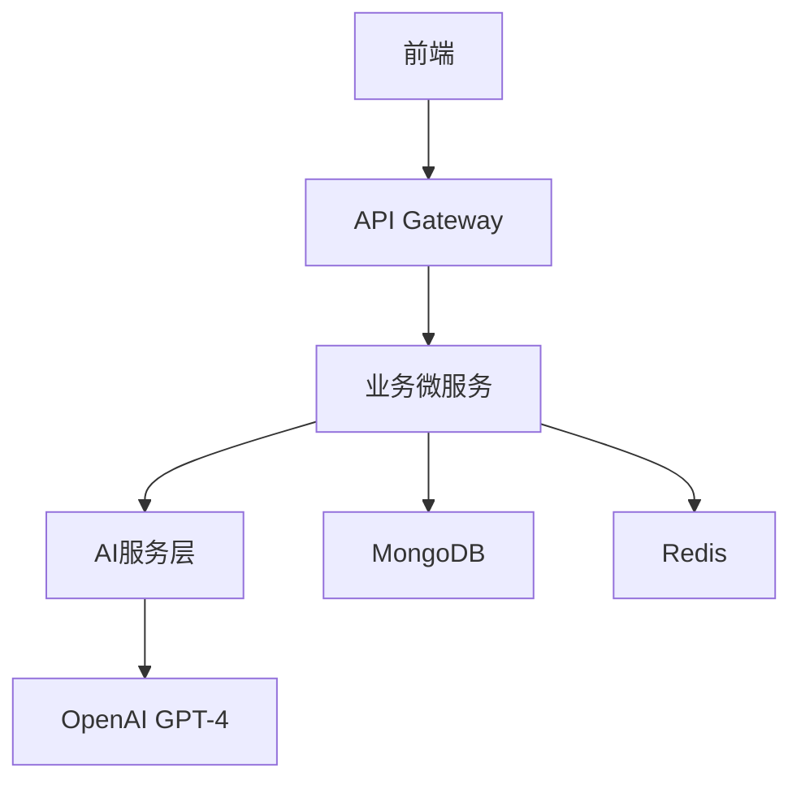
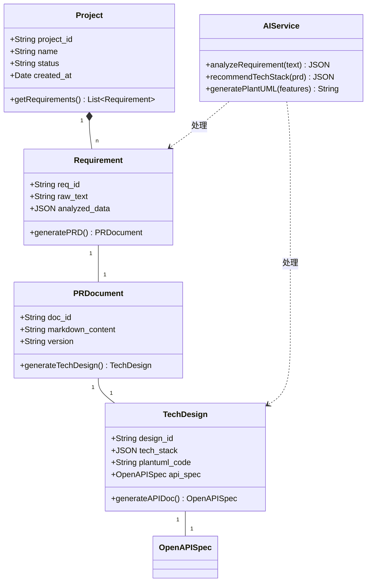

## prompt: 你是全栈开发工程师，根据上面的需求方案，设计需求技术方案，包含类图设计、业务用例设计，做好开发分工和处理，明确说明功能验收

## 答案
以下是根据需求方案设计的**v0.1+v0.2技术实施方案**，包含架构设计、核心类图、业务用例及开发计划，专为单人全栈开发优化：

---

### **系统架构设计**


**技术栈选择**：
- **前端**：React 18 + Ant Design + Monaco编辑器（代码编辑）
- **网关**：Nginx反向代理 + JWT鉴权
- **后端**：Python Flask（RESTful API） 
- **AI层**：LangChain + GPT-4 Turbo
- **数据库**：MongoDB（文档存储） + Redis（缓存）
- **基础设施**：Docker容器化

---

### **核心类图设计**


**关键类说明**：
1. `AIService`：AI功能代理层，封装所有GPT-4交互
2. `TechDesign`：技术方案核心载体，关联PlantUML和OpenAPI
3. `OpenAPISpec`：OpenAPI 3.0规范对象，支持Swagger导出

---

### **业务用例设计**
#### **用例1：AI需求分析**
```mermaid
sequenceDiagram
  actor 用户
  用户->>+前端： 提交需求文本
  前端->>+API网关： POST /api/analyze
  API网关->>+业务服务： 转发请求
  业务服务->>+AIService： analyzeRequirement(raw_text)
  AIService->>+GPT-4： 发送prompt
  GPT-4-->>-AIService： 返回JSON
  AIService-->>-业务服务： 结构化数据
  业务服务->>+MongoDB： 保存分析结果
  MongoDB-->>-业务服务： 确认
  业务服务-->>-前端： 返回用户故事地图
  前端->>用户： 展示可编辑面板
```

#### **用例2：技术方案生成**
```mermaid
sequenceDiagram
  actor 用户
  用户->>+前端： 选择PRD文档
  前端->>+业务服务： GET /api/tech-design?doc_id=123
  业务服务->>+AIService： recommendTechStack(prd_content)
  AIService->>+规则引擎： 执行决策树
  规则引擎-->>-AIService： 基础技术栈
  AIService->>+GPT-4： 补充细节
  GPT-4-->>-AIService： 完整方案
  AIService->>+PlantUML： 生成架构图代码
  PlantUML-->>-AIService： SVG图
  业务服务-->>-前端： 返回技术卡片+架构图
  用户->>前端： 调整参数
  前端->>业务服务： 更新方案
```

---

### **开发实施计划**
#### **v0.1开发模块（2周）**
| 模块 | 技术任务 | 验收标准 | 耗时 |
|------|----------|----------|------|
| **认证服务** | JWT实现+RBAC基础 | 通过Postman测试Auth流程 | 1.5天 |
| **需求分析引擎** | LangChain集成+Prompt工程 | 处理200字需求<5秒，输出合格JSON | 3天 |
| **PRD生成器** | Markdown模板引擎 | 自动生成符合ISO标准的PRD框架 | 2天 |
| **项目管理核心** | 甘特图算法+状态机 | 支持创建/启动/完成生命周期 | 2天 |
| **前端工作台** | 需求编辑器+实时预览 | 支持文本编辑和AI结果可视化 | 2天 |

#### **v0.2开发模块（3周）**
| 模块 | 技术任务 | 验收标准 | 耗时 |
|------|----------|----------|------|
| **技术推荐引擎** | 决策树+AI加权 | 推荐准确率>85%（测试数据集） | 4天 |
| **架构图服务** | PlantUML集成+渲染 | 生成可编辑的SVG架构图 | 3天 |
| **API设计器** | OpenAPI对象模型 | 符合OpenAPI 3.0规范 | 3天 |
| **文档同步** | GitHub API集成 | 自动提交openapi.yaml到仓库 | 2天 |
| **前端工作台** | 技术方案对比视图 | 支持三方案并行比较 | 3天 |

---

### **关键算法实现**
#### **1. 需求分析Prompt优化**
```python
def build_requirement_prompt(text):
    return f"""
    你是一个资深产品经理，请将以下需求转化为结构化数据：
    1. 提取不超过5个用户故事，格式：["作为[角色]，我想要[行动]，以便[价值]"]
    2. 识别功能点，按MoSCoW法分类
    3. 标记安全/性能等非功能需求
    
    输入需求：{text}
    
    输出JSON格式：
    {{
        "user_stories": [str],
        "features": {{
            "must": [str],
            "should": [str],
            "could": [str],
            "wont": [str]
        }},
        "non_functional": [str]
    }}
    """
```

#### **2. 技术栈决策树**
```python
def decide_tech_stack(requirements):
    # 规则引擎先行
    if "real-time" in requirements:
        return {"db": "Redis", "backend": "Node.js"}
    
    # AI补充细节
    prompt = f"基于需求'{requirements}'，补充技术方案细节"
    ai_suggestion = gpt4_query(prompt)
    
    # 人工规则修正
    if "high security" in requirements:
        ai_suggestion["auth"] = "OAuth2.0+JWT"  # 强制覆盖AI建议
    
    return ai_suggestion
```

---

### **功能验收标准**
#### **v0.1核心验收项**
1. **AI需求分析**
   - [ ] 输入200字需求，10秒内返回结构化JSON
   - [ ] 用户故事抽取准确率≥80%（人工评估）
   - [ ] 支持手动调整所有AI生成字段

2. **PRD生成**
   - [ ] 一键生成标准Markdown文档
   - [ ] 版本号自动递增（v1.0.0 → v1.0.1）
   - [ ] 变更历史自动记录

3. **项目管理**
   - [ ] 创建项目时自动关联PRD
   - [ ] 状态机流转：草稿→进行中→已完成
   - [ ] 甘特图正确反映时间线

#### **v0.2核心验收项**
1. **技术推荐**
   - [ ] 输出技术栈包含框架/DB/基础设施
   - [ ] 高风险技术（如微服务）触发警告
   - [ ] 支持方案对比（3方案并行）

2. **架构设计**
   - [ ] PlantUML代码可编辑并实时渲染
   - [ ] 导出SVG/PNG格式图片

3. **API设计器**
   - [ ] 自动生成CRUD接口骨架
   - [ ] 支持OpenAPI 3.0规范导出
   - [ ] 与GitHub仓库打通（自动提交）

---

### **质量保障措施**
1. **AI输出验证**：
   ```python
   def validate_ai_output(data):
       # 检查关键字段存在性
       assert 'user_stories' in data, "缺少用户故事"
       assert len(data['user_stories']) > 0, "用户故事为空"
       
       # 检查数据结构
       assert isinstance(data['features']['must'], list), "Must have应为列表"
       
       return True
   ```

2. **自动化测试覆盖**：
   - 单元测试：PyTest覆盖核心算法（≥80%）
   - 集成测试：Postman测试API链路（100%接口）
   - E2E测试：Cypress覆盖关键用户旅程

3. **性能测试**：
   ```bash
   # 使用Locust模拟并发
   locust -f test_ai_engine.py --users 100 --spawn-rate 10
   ```
   - 要求：AI接口P95延迟<8秒（GPT-4限制）

---

### **风险应对策略**
| 风险 | 应对方案 | 实施点 |
|------|----------|--------|
| **AI响应超时** | 队列+异步处理 | 需求分析请求加入Celery队列 |
| **技术方案冲突** | 人工规则优先 | 决策树结果覆盖AI建议 |
| **OpenAPI规范不符** | Schema校验 | 使用prance验证生成文档 |
| **前端复杂状态** | 状态机管理 | XState实现设计器状态流转 |

> **开发策略建议**：  
> 1. 优先实现**AI服务层**和**核心领域模型**  
> 2. 采用`模块驱动开发`：认证→需求分析→PRD→技术设计  
> 3. 每日构建Docker镜像验证端到端流程  
> 4. 关键算法使用Jupyter Notebook原型验证

此方案通过清晰的领域划分和AI/人工双轨决策机制，确保单人开发效率的同时保障系统可靠性。重点投入AI交互层和核心业务模型，界面层采用Ant Design加速开发。