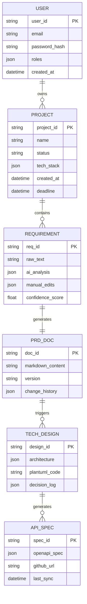
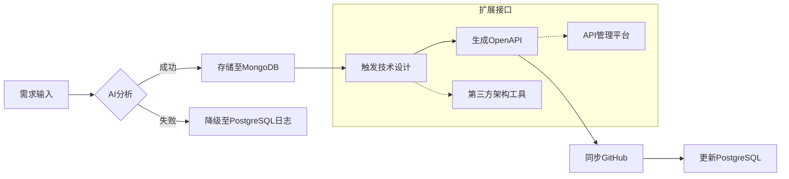

## prompt 你是一个数据库专家，需要根据上面的技术方案输出数据模型，请你给出一个易扩展的数据模型设计

## 回答
以下是为AI软件外包系统设计的**高扩展性数据模型**，采用文档型数据库（MongoDB）与关系型数据库（PostgreSQL）混合方案，兼顾灵活性与事务一致性：

---

### **核心数据模型设计**


---

### **集合/表结构详解**
#### **1. 用户系统 (PostgreSQL - 强一致性)**
```sql
CREATE TABLE users (
    user_id UUID PRIMARY KEY,
    email VARCHAR(255) UNIQUE NOT NULL,
    password_hash VARCHAR(128) NOT NULL,  -- bcrypt加密
    roles JSONB NOT NULL DEFAULT '["user"]',  -- 支持RBAC扩展
    created_at TIMESTAMPTZ DEFAULT NOW()
);

-- 扩展表：用户配置 (1:1关系)
CREATE TABLE user_profiles (
    user_id UUID REFERENCES users(user_id),
    notification_prefs JSONB DEFAULT '{"email": true}',
    ai_settings JSONB DEFAULT '{"confidence_threshold": 0.7}'
);
```

#### **2. 项目核心 (MongoDB - 灵活文档)**
```javascript
// projects 集合
{
  _id: ObjectId,
  name: String,             // 项目名称
  owner: ObjectId,          // 关联users.user_id
  status: {                 // 状态机
    type: String,
    enum: ['draft', 'active', 'completed', 'archived'],
    default: 'draft'
  },
  requirements: [ObjectId], // 关联requirements集合
  tech_stack: {             // 动态技术栈配置
    backend: String,
    database: String,
    infrastructure: String
  },
  timeline: {               // 甘特图数据
    milestones: [{
      name: String,
      date: ISODate,
      completed: Boolean
    }]
  },
  metadata: {               // 扩展预留
    custom_fields: Map,     // 键值对存储
    attachments: [String]   // 文件路径数组
  }
}
```

#### **3. AI需求中心 (MongoDB)**
```javascript
// requirements 集合
{
  _id: ObjectId,
  project_id: ObjectId,      // 所属项目
  raw_text: String,          // 原始需求文本
  ai_analysis: {             // AI结构化输出
    user_stories: [String],
    features: {
      must: [String],
      should: [String],
      could: [String],
      wont: [String]
    },
    non_functional: [String]
  },
  manual_edits: {            // 人工修正记录
    edited_at: ISODate,
    changes: Object          // 差异对比数据
  },
  confidence_score: Float,   // AI置信度(0-1)
  version_history: [{        // 版本追溯
    version: String,
    timestamp: ISODate
  }]
}
```

#### **4. 技术方案模块 (MongoDB)**
```javascript
// tech_designs 集合
{
  _id: ObjectId,
  prd_id: ObjectId,           // 关联PRD文档
  architecture: {             // 架构描述
    type: {
      type: String,           // microservices/monolith/serverless
      enum: ['microservices', 'monolith', 'serverless']
    },
    components: [{
      name: String,
      technology: String
    }]
  },
  plantuml_code: String,      // 原始PlantUML代码
  api_spec_id: ObjectId,      // 关联API_SPEC
  decision_log: [{            // 技术决策记录
    timestamp: ISODate,
    option: String,           // 被选方案
    alternatives: [String],   // 备选方案
    rationale: String         // 选择理由
  }],
  risk_assessment: {          // 风险评估
    performance: Number,      // 0-10分
    security: Number,
    maintainability: Number
  }
}
```

#### **5. API文档中心 (PostgreSQL - 强Schema)**
```sql
CREATE TABLE api_specs (
    spec_id UUID PRIMARY KEY,
    design_id UUID REFERENCES tech_designs(_id),
    openapi_spec JSONB NOT NULL CHECK (openapi_spec ? 'openapi'),
    github_url VARCHAR(255),
    last_sync TIMESTAMPTZ,
    validation_errors JSONB   -- 存储Schema校验错误
);

-- 索引优化
CREATE INDEX idx_spec_design ON api_specs(design_id);
CREATE INDEX idx_spec_github ON api_specs(github_url);
```

---

### **扩展性设计策略**
#### **1. 动态字段处理**
```javascript
// MongoDB中使用$set操作符动态扩展
db.projects.updateOne(
  { _id: projectId },
  { $set: { 
      "metadata.custom_fields.enterprise_grade": true,
      "metadata.legacy_system_integration": "SAP"
  }}
)
```

#### **2. 版本化文档设计**
```javascript
// 使用版本数组+当前指针
{
  _id: ObjectId,
  current_version: 2,
  versions: [
    {v:1, content: "初版", timestamp: ...},
    {v:2, content: "修订版", timestamp: ...}
  ]
}
```

#### **3. 混合存储策略**
| 数据类型 | 存储方案 | 理由 |
|---------|----------|------|
| 用户/权限 | PostgreSQL | 需要ACID事务 |
| AI生成内容 | MongoDB | 动态Schema支持 |
| API规范 | PostgreSQL | JSONB校验强Schema |
| 文件元数据 | MongoDB GridFS | 大文件存储 |

#### **4. 分片键设计（未来扩展）**
```javascript
sh.shardCollection("db.requirements", { project_id: 1 })  // 按项目分片
sh.shardCollection("db.tech_designs", { _id: "hashed" }) // 哈希分片
```

---

### **关键索引设计**
```javascript
// MongoDB
db.requirements.createIndex({ project_id: 1, confidence_score: -1 })
db.tech_designs.createIndex({ "architecture.type": 1 })

// PostgreSQL
CREATE INDEX idx_user_email ON users(email);
CREATE INDEX idx_spec_validation ON api_specs((openapi_spec->>'openapi'));
```

---

### **数据流扩展点**


---

### **数据模型优势**
1. **弹性扩展**：
   - 通过MongoDB动态字段支持新业务属性
   - PostgreSQL JSONB提供结构化扩展能力

2. **性能优化**：
   - 热数据（AI分析）内存缓存（Redis）
   - 冷数据（历史版本）自动归档（S3）

3. **混合事务**：
   ```python
   # 跨库事务示例（MongoDB+PostgreSQL）
   with transaction.postgres() as pg_tx, transaction.mongo() as mongo_tx:
       pg_tx.execute("INSERT INTO api_specs ...")
       mongo_tx.update("tech_designs", {"$set": {"api_spec_id": new_id}})
       # 双阶段提交
       pg_tx.commit()
       mongo_tx.commit()
   ```

4. **无缝升级**：
   - 新增模块通过`metadata.custom_fields`集成
   - 历史数据兼容：`$jsonSchema`验证旧文档

> **实施建议**：  
> 1. 初期使用MongoDB Atlas + PostgreSQL RDS托管服务  
> 2. 关键业务数据实现**双写校验**机制  
> 3. 为未来AI训练预留`data_snapshots`集合存储历史决策数据  
> 4. 通过GraphQL层封装多数据源访问  

此模型通过混合存储策略平衡灵活性与一致性，文档结构预留20%扩展字段，索引设计覆盖核心查询场景，可支撑从创业初期到企业级应用的平滑演进。