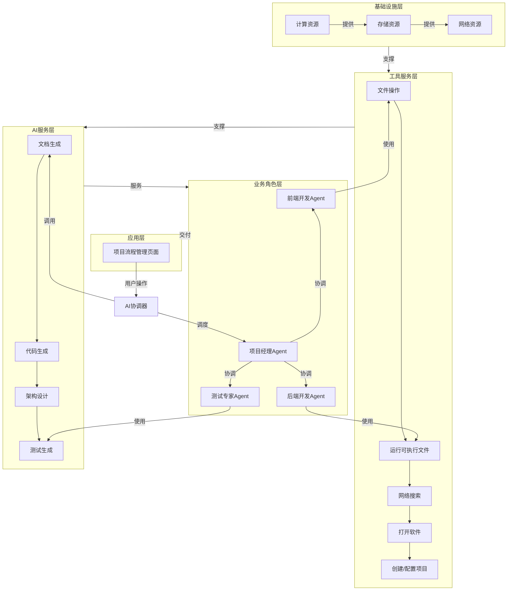
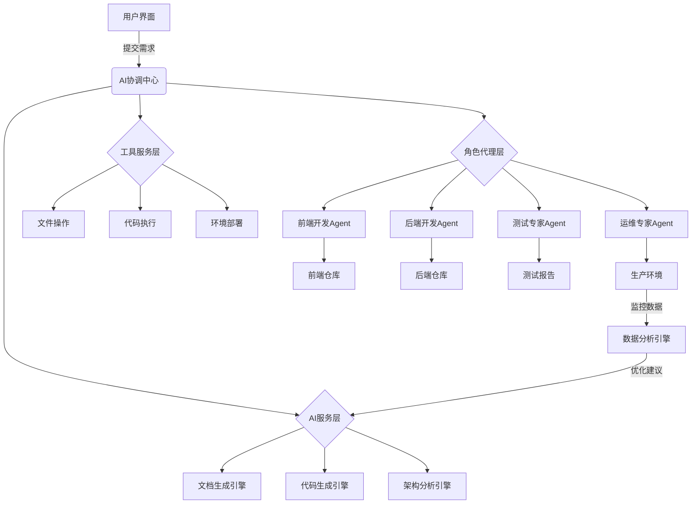

# 问题：

## 深度思考

我们正在设计一个外包开发团队应用，该应用将利用大模型辅助开发。根据之前的讨论，我们需要一个架构图以及一些示例代码来展示关键流程的实现。
### 架构图设计思路
我们将采用分层架构，从下到上包括：
1. **基础设施层**：提供计算、存储、网络等基础资源。
2. **工具服务层**：提供各种工具服务，如文件操作、运行可执行文件、网络搜索等。
3. **AI服务层**：大模型服务，包括文档生成、代码生成等。
4. **业务角色层**：各种角色（如前端开发、后端开发等）通过Agent代理与系统交互。
5. **应用层**：项目流程管理页面，用户界面。
同时，整个系统由AI协调器（AI_Coordinator）来协调各个Agent的工作，并驱动项目流程。
### 架构图（使用Mermaid描述）

### 示例代码
我们将展示一个简化的示例，其中项目经理Agent使用AI服务生成需求文档，并分配给前端开发Agent生成代码。
#### 场景描述
1. 项目经理Agent接收用户需求（例如：创建一个五子棋游戏）。
2. 项目经理Agent调用AI服务层生成需求文档。
3. 项目经理Agent将任务拆解，分配给前端开发Agent和后端开发Agent。
4. 前端开发Agent使用AI服务层生成前端代码。
#### 代码结构
我们使用Python来模拟Agent的行为，假设有一个AI服务类，以及各个Agent类。
```python
# 模拟AI服务层
class AIService:
    def generate_document(self, prompt: str) -> str:
        """使用大模型生成文档"""
        # 实际项目中会调用大模型API
        # 这里模拟返回一个字符串
        return f"生成的需求文档：{prompt}"
    def generate_code(self, prompt: str, role: str) -> str:
        """根据角色生成代码"""
        if role == "frontend":
            return f"// 前端代码：实现{prompt}"
        elif role == "backend":
            return f"// 后端代码：实现{prompt}"
        else:
            return "// 代码：实现通用功能"
# 基础Agent类
class Agent:
    def __init__(self, name: str, role: str):
        self.name = name
        self.role = role
        self.ai_service = AIService()
# 项目经理Agent
class ProjectManagerAgent(Agent):
    def __init__(self, name: str):
        super().__init__(name, "project_manager")
    def create_document(self, requirement: str) -> str:
        """创建需求文档"""
        prompt = f"需求：{requirement}，请生成详细的需求文档"
        return self.ai_service.generate_document(prompt)
    def assign_task(self, task: str, agent: Agent):
        """分配任务给其他Agent"""
        print(f"[项目经理] 将任务 '{task}' 分配给 {agent.name}({agent.role})")
        # 这里可以根据任务类型调用agent的对应方法
        if isinstance(agent, FrontendDeveloperAgent):
            return agent.implement_feature(task)
        elif isinstance(agent, BackendDeveloperAgent):
            return agent.implement_feature(task)
        else:
            print(f"未知的Agent类型，无法分配任务")
            return None
# 前端开发Agent
class FrontendDeveloperAgent(Agent):
    def __init__(self, name: str):
        super().__init__(name, "frontend_developer")
    def implement_feature(self, feature: str) -> str:
        """实现前端功能"""
        print(f"[前端开发] 正在实现功能：{feature}")
        code = self.ai_service.generate_code(feature, "frontend")
        print(f"[前端开发] 生成代码：\n{code}")
        return code
# 后端开发Agent
class BackendDeveloperAgent(Agent):
    def __init__(self, name: str):
        super().__init__(name, "backend_developer")
    def implement_feature(self, feature: str) -> str:
        """实现后端功能"""
        print(f"[后端开发] 正在实现功能：{feature}")
        code = self.ai_service.generate_code(feature, "backend")
        print(f"[后端开发] 生成代码：\n{code}")
        return code
# 模拟运行
if __name__ == "__main__":
    # 创建Agent
    pm = ProjectManagerAgent("张经理")
    frontend_dev = FrontendDeveloperAgent("小李")
    backend_dev = BackendDeveloperAgent("王工")
    # 项目经理创建需求文档
    requirement = "开发一个联网五子棋游戏App"
    doc = pm.create_document(requirement)
    print(f"[需求文档]\n{doc}\n")
    # 项目经理拆解任务并分配
    pm.assign_task("设计五子棋游戏界面", frontend_dev)
    pm.assign_task("实现五子棋游戏逻辑和联网对战", backend_dev)
```
### 运行结果示例
```
[需求文档]
生成的需求文档：需求：开发一个联网五子棋游戏App，请生成详细的需求文档
[项目经理] 将任务 '设计五子棋游戏界面' 分配给 小李(frontend_developer)
[前端开发] 正在实现功能：设计五子棋游戏界面
[前端开发] 生成代码：
// 前端代码：实现设计五子棋游戏界面
[项目经理] 将任务 '实现五子棋游戏逻辑和联网对战' 分配给 王工(backend_developer)
[后端开发] 正在实现功能：实现五子棋游戏逻辑和联网对战
[后端开发] 生成代码：
// 后端代码：实现实现五子棋游戏逻辑和联网对战
```
### 说明
1. 以上代码模拟了项目经理Agent创建需求文档，并将任务分配给前端和后端开发Agent的过程。
2. 实际项目中，AI服务层会调用大模型API（如GPT、DeepSeek-Coder等）来生成文档和代码。
3. 我们还可以扩展Agent的行为，比如加入代码提交、自动测试等环节。
### 下一步建议
1. 完善其他角色Agent（如测试专家、运维专家）的行为。
2. 实现Agent之间的通信机制（例如通过消息队列）。
3. 集成真实的大模型API。
4. 构建Web应用，提供用户界面（项目流程管理页）。
如果需要更详细的某部分实现，请随时告诉我。

## 回答

以下是为外包开发团队应用设计的架构图及核心模块示例代码，聚焦AI辅助开发的实现：

---

### **系统架构图（Mermaid）**


---

### **关键模块示例代码**

#### 1. AI协调中心（任务调度核心）
```python
class AICoordinator:
    def __init__(self):
        self.agents = {
            'frontend': FrontendAgent(),
            'backend': BackendAgent(),
            'architect': ArchitectAgent(),
            'tester': TestingAgent()
        }
        self.project_data = {}
    
    def process_requirement(self, user_input: str):
        """处理用户原始需求"""
        # 调用大模型生成结构化需求
        structured_req = self._call_llm(
            prompt=f"将用户需求转为JSON格式: {user_input}",
            output_type="json"
        )
        self.project_data = structured_req
        
        # 自动生成排期
        schedule = self.generate_schedule()
        
        # 分配任务给Agent
        self.dispatch_tasks(schedule)
        return {"status": "processing", "schedule": schedule}
    
    def generate_schedule(self):
        """AI生成项目排期"""
        return self._call_llm(
            prompt=f"根据需求生成敏捷开发排期:\n{json.dumps(self.project_data)}",
            constraints={"max_weeks": 4, "risk_buffer": 0.3}
        )
    
    def dispatch_tasks(self, schedule):
        """分配任务到各角色Agent"""
        for phase in schedule['phases']:
            agent_type = phase['owner']
            self.agents[agent_type].receive_task(
                task=phase['tasks'],
                context=self.project_data
            )
    
    def _call_llm(self, prompt: str, output_type="json", **kwargs):
        """调用大模型服务（模拟实现）"""
        # 实际对接LLM API (e.g. OpenAI/DeeSeek)
        return mock_llm_service(prompt, output_type, **kwargs)
```

#### 2. 前端开发Agent（代码生成示例）
```typescript
class FrontendAgent {
  async generateComponent(spec: ComponentSpec): Promise<CodeOutput> {
    const prompt = `
      根据以下需求生成React TSX组件：
      功能: ${spec.functionality}
      Props要求: ${JSON.stringify(spec.props)}
      样式要求: ${spec.styleGuide}
      约束: 使用Tailwind CSS, 响应式设计
    `;

    // 调用代码生成引擎
    const code = await AIService.generateCode(
      prompt,
      {
        framework: "react",
        typescript: true,
        styling: "tailwind"
      }
    );

    // 自动创建文件
    FileService.createFile(
      path: `src/components/${spec.name}.tsx`,
      content: code
    );

    // 自动生成单元测试
    this.generateTests(spec, code);
    
    return { status: "completed", files: [spec.name] };
  }

  private async generateTests(spec: ComponentSpec, code: string) {
    const testPrompt = `
      为以下React组件生成Jest测试用例：
      ${code}
      测试重点: ${spec.testFocus}
    `;
    const testCode = await AIService.generateCode(testPrompt, { testFramework: "jest" });
    FileService.createFile(`tests/components/${spec.name}.test.tsx`, testCode);
  }
}
```

#### 3. 架构分析引擎（五子棋游戏示例）
```python
class ArchitectureAnalyzer:
    def analyze_project(self, requirements: dict):
        """分析技术架构方案"""
        # 生成架构图
        diagram_prompt = f"""
        为{requirements['project_type']}项目生成Mermaid架构图，包含：
        - 前端框架选择
        - 后端服务划分
        - 数据库选型
        - 网络通信协议
        特殊要求: {requirements['special_requirements']}
        """
        architecture_diagram = self._call_llm(diagram_prompt, diagram_type="mermaid")
        
        # 技术栈推荐
        tech_prompt = f"""
        推荐{requirements['project_type']}项目的技术栈：
        项目规模: {requirements['scale']}
        团队技能: {requirements['team_skills']}
        性能要求: {requirements['performance']}
        安全要求: {requirements['security_level']}
        """
        tech_stack = self._call_llm(tech_prompt, format="markdown")
        
        # 风险分析
        risk_prompt = f"识别架构方案中的技术风险：\n{architecture_diagram}"
        risks = self._call_llm(risk_prompt, format="list")
        
        return {
            "architecture_diagram": architecture_diagram,
            "tech_stack": tech_stack,
            "risk_analysis": risks
        }

# 五子棋游戏架构生成示例输出
"""
graph LR
    A[前端] -->|WebSocket| B[游戏服务器]
    B --> C[匹配服务]
    B --> D[房间管理]
    B --> E[棋局状态]
    E --> F[Redis]
    F --> G[MySQL]
    A --> H[用户服务]
"""
```

#### 4. 自动化部署流水线
```yaml
# deploy-pipeline.yml
stages:
  - codegen
  - build
  - deploy
  - monitor

ai_codegen:
  stage: codegen
  script:
    - python -m AICoordinator --phase=generation
  artifacts:
    paths:
      - src/
      - tests/

security_scan:
  stage: build
  image: owasp/zap
  script:
    - zap-baseline.py -t https://staging-app.com

auto_deploy:
  stage: deploy
  trigger: ai_deploy_agent
  rules:
    - if: $SECURITY_SCAN_RESULT == "pass"

monitoring:
  stage: monitor
  script:
    - python perf_monitor.py
    - curl -X POST -d '{"alert_type": $PERF_STATUS}' https://ai-coordinator/alerts
```

---

### **五子棋关键功能实现示例**

#### 实时对战同步服务（WebSocket）
```typescript
// 游戏服务器核心逻辑
class GomokuServer {
  private rooms: Map<string, GameRoom> = new Map();

  handleMessage(ws: WebSocket, message: any) {
    switch (message.type) {
      case 'CREATE_ROOM':
        const room = new GameRoom();
        this.rooms.set(room.id, room);
        ws.send(JSON.stringify({ type: 'ROOM_CREATED', roomId: room.id }));
        break;
        
      case 'JOIN_ROOM':
        const game = this.rooms.get(message.roomId);
        if (game && game.addPlayer(message.player)) {
          this.broadcastState(game);
        }
        break;
        
      case 'MOVE':
        const room = this.rooms.get(message.roomId);
        if (room && room.makeMove(message.player, message.position)) {
          this.broadcastState(room);
          if (room.checkWin()) {
            this.endGame(room);
          }
        }
        break;
    }
  }

  private broadcastState(room: GameRoom) {
    const state = room.getState();
    room.players.forEach(player => {
      player.ws.send(JSON.stringify({
        type: 'GAME_STATE',
        state: {
          board: state.board,
          currentPlayer: state.currentPlayer,
          // 仅向当前玩家发送私有数据
          privateData: player.id === state.currentPlayer ? 
            { validMoves: room.calculateValidMoves() } : null
        }
      }));
    });
  }
}
```

#### 胜局判定算法
```python
def check_win(board, last_move):
    """检查五子棋获胜条件"""
    directions = [
        [(0, 1), (0, -1)],   # 水平
        [(1, 0), (-1, 0)],   # 垂直
        [(1, 1), (-1, -1)],  # 对角线
        [(1, -1), (-1, 1)]   # 反对角线
    ]
    
    player = board[last_move[0]][last_move[1]]
    for dir_pair in directions:
        count = 1  # 当前落子位置
        
        # 正反两个方向检测
        for dx, dy in dir_pair:
            x, y = last_move[0] + dx, last_move[1] + dy
            while 0 <= x < 15 and 0 <= y < 15:
                if board[x][y] == player:
                    count += 1
                    x += dx
                    y += dy
                else:
                    break
        
        if count >= 5:
            return True
            
    return False
```

---

### **技术栈推荐**
| 模块 | 推荐技术 | AI集成方案 |
|------|----------|-----------|
| **前端** | React + TypeScript + Tailwind | 使用Prompt工程生成组件代码 |
| **后端** | Node.js + WebSocket + Redis | AI生成API路由和业务逻辑 |
| **部署** | Docker + Kubernetes + Helm | AI生成K8s配置和部署脚本 |
| **AI服务** | FastAPI + LangChain + DeepSeek-Coder | 模型路由和任务调度 |
| **监控** | Prometheus + Grafana + ELK | AI异常检测和告警生成 |

---

### **部署运行说明**
1. 初始化AI协调中心：
```bash
docker-compose up -d ai-coordinator
```

2. 提交五子棋项目需求：
```http
POST /api/projects
Content-Type: application/json

{
  "name": "联网五子棋",
  "requirements": "支持实时对战、房间系统、段位积分、观战模式",
  "deadline": "2023-12-30"
}
```

3. 查看自动生成产物：
```bash
# 架构文档
open ./output/gomoku-architecture.md

# 前端组件
ls ./src/components/board.tsx

# 部署配置
cat ./deploy/k8s/production.yml
```

此架构可实现：需求输入→自动生成技术方案→代码实现→测试部署的全流程自动化，项目经理可通过可视化界面监控各Agent任务状态。需要完整实现或特定模块扩展，可继续深入讨论。