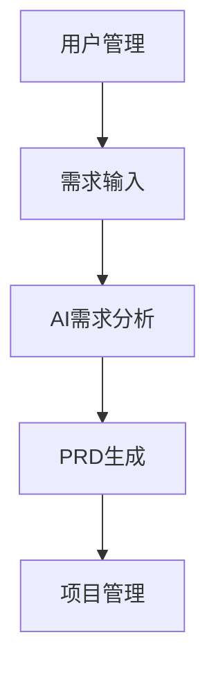
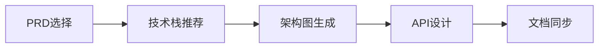
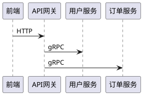

## prompt: 你是一个产品经理，结合上面的项目管理方案，输出v0.1 和 v0.2的需求设计方案

以下是根据项目管理方案拆解的 **v0.1 和 v0.2 需求设计方案**，聚焦核心价值交付，采用模块化设计确保单人开发效率：

---

### **v0.1 需求设计方案：核心项目管理+需求AI原型（2周）**
**核心目标**：搭建基础框架，实现AI需求自动化分析  
**用户旅程**：需求输入 → AI分析 → 人工校正 → 生成PRD → 项目创建

#### **功能模块设计**


1. **用户与权限系统（MVP）**  
   - 功能清单：
     - 邮箱注册/登录（JWT鉴权）
     - 角色区分：客户/开发者（初始仅开发者角色）
     - 个人工作台仪表盘

2. **AI需求输入引擎**  
- 交互流程：
```mermaid
sequenceDiagram
用户->>+系统: 粘贴需求描述（文本）

系统->>+AI引擎： 调用GPT-4 Turbo分析

AI引擎-->>-系统： 返回结构化数据：
  • 用户故事地图
  • 功能点列表
  • 优先级矩阵（MoSCoW分类）
系统->>用户： 可视化编辑面板

```
  - 核心算法：
    ```python
    def analyze_requirements(raw_text):
        prompt = f"""
        作为产品专家，请分析以下需求：
        {raw_text}
        输出JSON格式：{"user_stories":[], "features":[], "priority_matrix":{}}
        """
        return gpt4_completion(prompt)
    ```

3. **PRD文档生成器**  
   - 自动化输出：
     - 动态生成Markdown文档（含版本号）
     - 包含标准章节：背景/用户故事/功能清单/非功能需求
   - 人工干预点：
     - 可视化编辑器支持手动调整内容
     - 变更历史自动记录

4. **项目管理看板**  
   - 最小功能集：
     - 创建项目（关联PRD文档）
     - 状态跟踪：待启动/进行中/已完成
     - 简易甘特图（基于时间预估）

#### **非功能需求**
| 类型       | 要求                          | 实现方案                     |
|------------|-------------------------------|------------------------------|
| 性能       | AI响应<5秒                    | 请求队列+超时重试机制        |
| 安全       | 敏感数据加密存储              | AES-256加密用户需求原文      |
| 可扩展性   | 支持后续模块接入              | 预留Webhook接口              |

#### **原型设计要点**
- **需求分析页**：  
  
- **PRD输出页**：  
  左侧Markdown源码预览，右侧实时渲染效果

---

### **v0.2 需求设计方案：技术方案设计器+API文档生成（3周）**
**核心目标**：实现技术决策自动化，打通需求到设计的闭环  
**用户旅程**：选择PRD → 生成技术方案 → 输出API文档 → 同步开发环境

#### **功能模块设计**


1. **智能技术栈推荐器**  
   - 决策逻辑：
     ```python
     def recommend_tech_stack(prd):
         if "实时数据处理" in prd:
             return {"backend": "Node.js+Socket.IO", "database": "Redis"}
         elif "高并发" in prd:
             return {"backend": "Go", "database": "Cassandra"}
         else:
             return {"backend": "Python/Flask", "database": "PostgreSQL"}
     ```
   - 输出形式：  
     ✅ 技术栈卡片（框架/数据库/基础设施）  
     ⚠️ 风险提示（如学习曲线陡峭）

2. **架构图生成引擎**  
   - 输入：技术栈选择 + 功能模块清单
   - 输出：
     - PlantUML自动生成架构图
     - 导出PNG/SVG格式
   - 示例输出：



3. **API智能设计台**  
   - 核心流程：
     1. 解析PRD中的功能点
     2. 自动生成RESTful端点建议
     3. 交互式编辑参数/响应格式
   - 自动化特性：
     - 根据实体关系自动生成CRUD接口
     - 智能补全状态码（如404/500）

4. **OpenAPI文档同步**  
   - 自动化流水线：
     ```mermaid
     graph LR
      编辑完成 --> 生成openapi.yaml 
      生成openapi.yaml --> 推送至GitHub
      推送至GitHub --> 触发SwaggerUI更新
     ```
   - 输出物：  
     在线可交互的API文档（含Try-it功能）

#### **非功能需求**
| 类型       | 要求                          | 实现方案                     |
|------------|-------------------------------|------------------------------|
| 一致性     | 技术方案与PRD功能100%对应     | 需求追溯矩阵实现             |
| 可移植性   | API文档支持本地导出           | 提供openapi.yaml下载         |
| 开发友好   | 自动生成代码桩                | Flask路由模板自动输出        |

#### **原型设计要点**
- **技术决策面板**：  
    
- **API设计工作台**：  
  三栏布局：端点树 / 参数配置 / 实时文档预览

---

### **版本间依赖关系**
```mermaid
gantt
    title 版本交付依赖链
    dateFormat  YYYY-MM-DD
    section v0.1
    用户系统      ：done,    des1, 2025-08-10, 3d
    AI需求分析    ：active,  des2, 2025-08-13, 5d 
    PRD生成器    ：         des3, 2025-08-18, 4d

    section v0.2
    技术栈推荐    ：         des4, after des3, 7d
    架构图生成    ：         des5, after des4, 5d
    API设计器    ：         des6, after des5, 8d
```

### **关键设计决策**
1. **AI边界控制**  
   - 所有AI输出必须经过人工确认环节
   - 设置「置信度评分」阈值（<0.7时标红警告）

2. **防过度设计机制**  
   - 技术方案生成器内置约束规则：
     ```python
     if project_size == "small":
         disable("microservices")  # 禁止推荐微服务
     ```

3. **文档自动化链路**  
   ```mermaid
   graph LR
     PRD --AI解析--> 技术方案
     技术方案 --模板引擎--> API文档
     API文档 --Webhook--> 代码仓库
   ```

> **交付验证标准**：  
> - v0.1：用户完成从需求输入到PRD生成的全流程≤8分钟  
> - v0.2：技术方案设计耗时比手动设计减少70%  
> 
> 此设计确保每个版本交付独立价值，同时通过自动化链路大幅降低单人开发负荷。