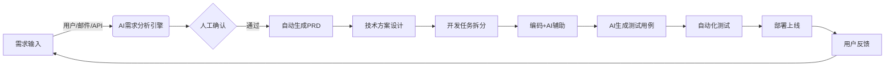

## prompt：你是一个全栈开发工程师，现在需要独立开发一个AI软件外包系统，可以独立完成项目管理、需求设计、开发技术方案设计、测试用例设计。需要你给我输出一下这个系统的项目管理方案。


## 答案
以下是为「AI软件外包系统」设计的**单人全栈开发项目管理方案**，结合高效流程、自动化工具和风险控制策略，专为独立开发者优化：

---

### **1. 项目目标与范围**
#### **核心功能模块**
| 模块               | 功能要点                                                                 |
|--------------------|--------------------------------------------------------------------------|
| **项目管理**       | 项目创建/状态跟踪/甘特图/里程碑/工时统计                                 |
| **需求设计**       | AI需求分析（用户故事生成）/PRD文档自动生成/需求版本管理                  |
| **开发方案设计**   | 技术栈推荐/架构图生成/API文档自动生成/代码片段建议                       |
| **测试管理**       | AI测试用例生成/用例关联需求/Bug跟踪/自动化测试报告                       |
| **AI核心引擎**     | GPT-4 Turbo集成/自定义Prompt库/结果人工校正机制                         |

#### **非功能需求**
- 响应时间：<2s（AI操作<5s）
- 身份验证：JWT + RBAC权限模型
- 数据安全：敏感信息AES加密存储

---

### **2. 开发流程设计（敏捷精简版）**


**关键流程说明：**
1. **需求收集阶段**  
   - 使用NLP引擎解析用户原始需求（文本/语音转文本）
   - 自动输出用户故事地图和优先级矩阵（MoSCoW法）

2. **设计阶段**  
   - 技术方案设计采用**决策树模式**：
     ```python
     if "高并发" in requirements:
         return "微服务架构+Redis缓存"
     elif "快速迭代" in requirements:
         return "Serverless+低代码平台"
     ```

3. **开发阶段**  
   - 代码辅助：GitHub Copilot + 自定义代码模板库
   - 每日自动生成开发日志（Git提交分析+AI摘要）

4. **测试阶段**  
   - 测试用例生成算法：
     ```
     输入: 需求描述 + 技术方案  
     输出: 边界值用例 + 异常流用例 + 安全测试点
     ```

---

### **3. 时间规划（12周版本）**
| 迭代   | 周期    | 交付物                          | 技术重点                     |
|--------|---------|---------------------------------|------------------------------|
| **v0.1** | 2周     | 核心项目管理+需求AI原型         | Flask后端/Prompt工程         |
| **v0.2** | 3周     | 技术方案设计器+API文档生成       | React前端/OpenAPI规范        |
| **v0.3** | 3周     | 测试用例生成引擎                | Jest集成/异常流建模          |
| **v0.4** | 2周     | 部署模块+监控系统               | Docker/K8s编排/Prometheus    |
| **缓冲期** | 2周     | 压力测试/安全加固               | Locust测试/OWASP扫描         |

---

### **4. 风险管理矩阵**
| 风险类型          | 应对策略                                                                 |
|-------------------|--------------------------------------------------------------------------|
| **AI生成质量波动** | 建立人工校正工作流 + 用户反馈评分机制                                    |
| **技术债累积**     | 每周五定为「重构日」+ SonarQube自动化检测                                |
| **进度延迟**       | 功能模块分级：MVP(必须)/V2(重要)/V3(可选)                                |
| **安全漏洞**       | 每月第三方渗透测试 + 关键操作二次认证                                    |

---

### **5. 工具链配置**
| 类别             | 工具栈                                                                 |
|------------------|-----------------------------------------------------------------------|
| **开发环境**     | VS Code(Dev Containers) + GitHub Codespaces                           |
| **AI核心**       | LangChain + GPT-4 Turbo + FAISS向量库                                 |
| **自动化测试**   | Playwright(UI)/Jest(单元)/Postman(API)                                |
| **DevOps**       | GitHub Actions(CI/CD) + Sentry(监控) + ELK(日志)                      |
| **文档自动化**   | MkDocs + Swagger + PlantUML                                           |

---

### **6. 质量保障措施**
- **代码质量**：  
  ```bash
  # 每日自动执行
  black . && pylint . && pytest --cov=.
  ```
- **AI输出校验**：  
  设计置信度评分模型：`score = 0.4*一致性 + 0.3*完整性 + 0.3*可测试性`
- **用户验收测试**：  
  提供需求追溯矩阵：`需求ID -> 设计文档 -> 测试用例 -> Bug记录`

---

### **7. 关键文档模板**
1. **AI需求规格说明书**  
   - 自动生成章节：  
     ```markdown
     ## 自动化生成部分
     ### 用户故事
     {{ai_generated_stories}}
     ### 非功能需求
     {{ai_security_req}}
     ```

2. **技术方案决策记录**（ADR）  
   ```txt
   ## 选择MongoDB的原因
   [AI分析结论] 
   - 优势：动态schema适配需求变更
   - 风险：事务支持弱 → 解决方案：添加补偿事务层
   ```

---

### **总结：单人高效开发策略**
1. **AI优先原则**：所有文档/代码/测试首先生成AI草案
2. **自动化流水线**：CI/CD覆盖测试→部署→监控全链路
3. **模块化设计**：通过微前端(qiankun)/微服务隔离核心功能
4. **渐进式交付**：每周向测试用户发布可运行版本

> **特别建议**：在架构设计中预留「人工干预接口」，当AI生成结果不符合预期时，可快速切换至传统手动模式保障交付。

此方案平衡了AI自动化与人工控制，单人开发模式下建议聚焦核心模块（需求分析+文档生成），优先交付80%自动化功能，剩余20%通过人工校准实现精准交付。