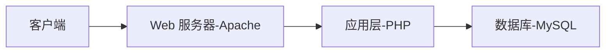
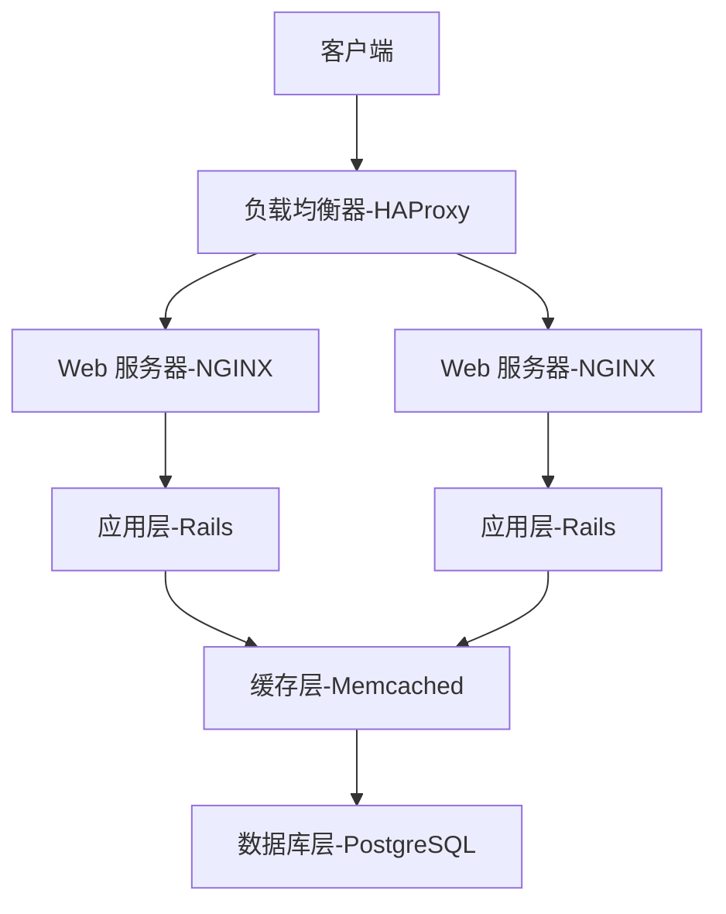
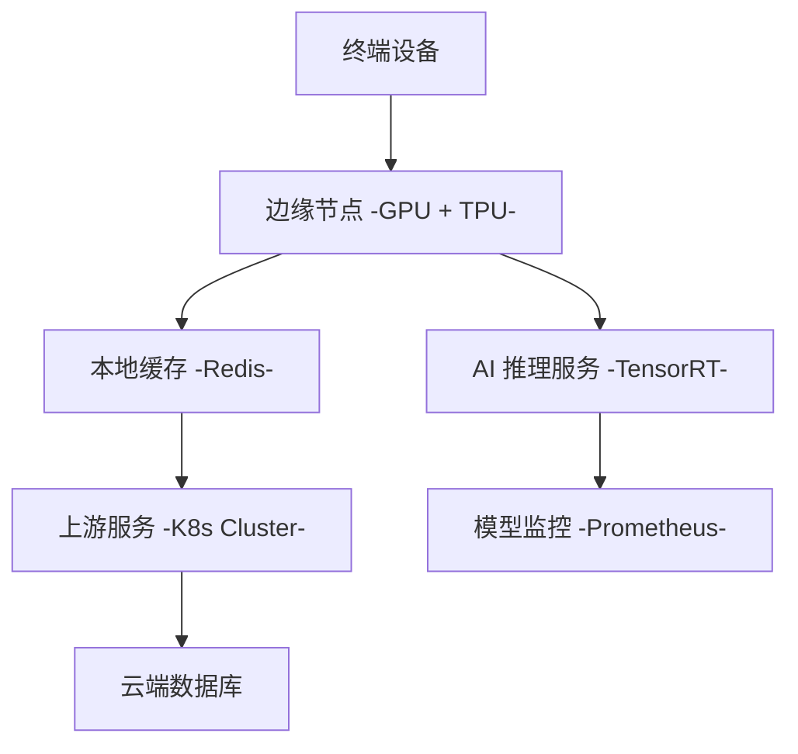
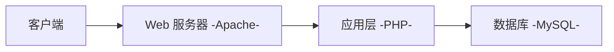
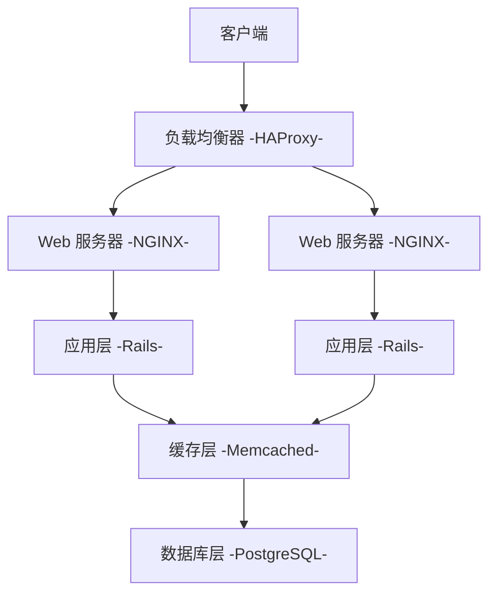
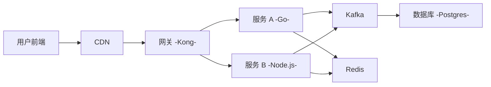

# 问题：帮我写一篇关于互联网系统架构演变的文章，要求内容丰富，实践与理论结合，适当进行图示说明
回答如下：
# 互联网系统架构的演变：从单体到边缘云的完整图景  

> 本文兼顾理论与实践，力求用图示与案例来说明互联网系统架构随时间推移的演进。  
> 目标读者：系统架构师、后端工程师、产品经理以及对互联网技术感兴趣的技术爱好者。  

---

## 1. 引言  

> “架构不是把系统拼在一起的方式，而是让它们在变更时保持弹性、可维护、可扩展。”  
> —— *Martin Fowler*  

从早期的单体应用到如今的边缘云微服务，互联网系统架构经历了 **技术迭代、业务需求、性能瓶颈** 等多重驱动。每一次重大跃迁都伴随着 **新设计原则** 的诞生，例如 **CAP 定理**、**服务拆分**、**容器化** 与 **无服务器** 等。

本文分为**四个时代**：  
1. 单体时代（1990‑2005）  
2. 传统 Web 时代（2005‑2015）  
3. 微服务与云原生时代（2015‑2025）  
4. 边缘与 AI 时代（2025‑未来）  

在每一时代中，先说明**理论背景**，随后给出**典型案例**，并用 **Mermaid** 或 **PlantUML** 代码绘制简洁图示。

> ⚠️ 本文中所有图示均为 **示意**，用于帮助理解，实际实现细节请结合项目需求。

---

## 2. 单体时代（1990‑2005）  

### 2.1 理论基础  

- **单体架构**：所有业务模块编译为单个可执行文件或单一进程。  
- **Turing 完全**：可以实现任何可编程功能。  
- **事务一致性**：使用单机事务（ACID）保证数据一致。  

> **优点**：部署简单、无分布式开销、开发迭代快。  
> **缺点**：可维护性差、难扩容、单点故障、技术栈锁定。

### 2.2 典型案例  

| 项目 | 技术栈 | 规模 | 经验教训 |
|------|--------|------|----------|
| **Amazon（原始网站）** | PHP + MySQL | 3 万页 | 单体易维护，但随着流量增长难以水平扩展。 |
| **WordPress** | PHP + MySQL | 全球数百万站点 | 轻量级单体，插件生态使得可扩展性得到补偿。 |

### 2.3 结构图  



> 典型单体架构图：一条数据流，全部业务集中在同一层。

---

## 3. 传统 Web 时代（2005‑2015）  

### 3.1 理论背景  

- **三层架构**：客户端 → Web 服务器 → 数据库。  
- **负载均衡**：使用硬件或 HAProxy 分流请求。  
- **缓存**：Memcached、Redis，减轻数据库压力。  
- **CAP 定理**：在分布式系统中需要在一致性、可用性和分区容忍性之间做权衡。  

> **主要目标**：通过横向扩展 Web 服务器、使用 CDN 提升性能、采用缓存减少数据库压力。

### 3.2 典型案例  

| 项目 | 技术栈 | 规模 | 经验教训 |
|------|--------|------|----------|
| **Twitter (2006‑2010)** | Ruby on Rails + PostgreSQL | 3M+ 用户 | 单体 Rails 适合快速迭代，但需拆分后台任务（Sidekiq） |
| **Netflix** | Java + MySQL + Memcached | 1B+ 观看 | 使用 CDN 与缓存体系极大降低数据库压力 |

### 3.3 结构图  



> 经典 3 层架构：客户端 → 前端负载均衡 → 后端应用层 → 缓存层 → 数据库。

### 3.4 关键技术  

- **CDN**：Cloudflare、Akamai。  
- **异步任务队列**：Resque、Celery。  
- **数据库分片**：基于 sharding 的水平扩展。  

---

## 4. 微服务与云原生时代（2015‑2025）  

### 4.1 理论基础  

- **微服务**：将单体拆分为独立的、围绕业务功能的服务。  
- **服务治理**：服务发现、配置中心、熔断器。  
- **容器化**：Docker + Kubernetes。  
- **无服务器（Serverless）**：按需执行函数，免除服务器管理。  
- **Observability**：监控（Prometheus）、日志（ELK）、追踪（Jaeger）。  

> **核心目标**：解耦业务、提升可扩展性、实现持续交付。  

### 4.2 典型案例  

| 项目 | 技术栈 | 规模 | 经验教训 |
|------|--------|------|----------|
| **Netflix** | Java + Spring Cloud + Kubernetes | 3B+ 观看 | 采用 **Chaos Monkey** 检测系统弹性。 |
| **Uber** | Go + Docker + Mesos | 1000+ 服务 | 需要强大的 **服务治理** 与 **限流**。 |
| **Shopify** | Ruby on Rails + Docker + ECS | 500+ 服务 | 从单体到微服务过程中，保持 **API 合约** 变得至关重要。 |

### 4.3 结构图  

```mermaid
graph LR
  A[用户前端] --> B[CDN]
  B --> C[网关 -Kong)]
  C --> D1[服务 A -Go)]
  C --> D2[服务 B -Node.js)]
  D1 --> E[Kafka]
  D2 --> E
  E --> F[数据库 -Postgres)]
  D1 --> G[Redis]
  D2 --> G
```

> 典型微服务图：网关 → 多服务 → 消息队列 → 数据库 + 缓存。

### 4.4 关键技术与实践  

| 技术 | 作用 | 典型工具 |
|------|------|----------|
| **服务发现** | 动态定位服务实例 | Consul、Eureka |
| **API 网关** | 请求聚合、认证、限流 | Kong、Nginx Plus |
| **消息总线** | 异步解耦 | Kafka、RabbitMQ |
| **容器编排** | 自动化部署、弹性伸缩 | Kubernetes、ECS |
| **CI/CD** | 持续集成与交付 | GitLab CI、ArgoCD |
| **Observability** | 监控、日志、追踪 | Prometheus、Grafana、ELK、Jaeger |

### 4.5 典型痛点与解决方案  

1. **服务数量膨胀导致治理难度**  
   - **解决**：采用**Domain Driven Design (DDD)** 与 **Bounded Context**，保持服务粒度合理。  
2. **跨服务事务管理**  
   - **解决**：使用**Saga** 或 **Eventual Consistency**，配合消息队列。  
3. **网络延迟与链路追踪**  
   - **解决**：统一**OpenTelemetry** 规范，收集链路数据。  

---

## 5. 边缘与 AI 时代（2025‑未来）  

### 5.1 理论背景  

- **边缘计算**：把计算资源推向网络边缘，减少延迟、提高隐私安全。  
- **AI 原生**：在架构设计时即考虑机器学习模型的部署、推理与监控。  
- **去中心化**：Web3、区块链技术提供数据所有权与可信计算。  

> **目标**：在低延迟、高并发、AI 推理与去中心化需求下，重新思考系统边界与服务治理。

### 5.2 典型案例  

| 项目 | 技术栈 | 规模 | 经验教训 |
|------|--------|------|----------|
| **Tesla FSD** | Edge AI + Kubernetes | 边缘车载 | 必须保证 **模型的热更新** 与 **安全**。 |
| **Argo Workflows** | Kubernetes + Serverless | 自动化流程 | 将工作流拆解为**微服务**+**事件驱动** |
| **Polkadot** | 区块链 + 去中心化服务 | 跨链网络 | 需要**去中心化服务治理**与**可插拔**共识机制。 |

### 5.3 结构图（边缘 + AI）  



> 典型边缘 AI 架构：终端 → 边缘节点 → AI 推理 → 本地缓存 → 云端同步。

### 5.4 关键技术与趋势  

| 方向 | 核心技术 | 影响 |
|------|----------|------|
| **边缘网关** | Envoy + EdgeX Foundry | 统一安全与流量治理 |
| **AI 可扩展** | Triton Inference Server、Kubeflow | 统一推理与训练 |
| **事件驱动** | Kafka + Pulsar | 高可扩展、低延迟 |
| **去中心化治理** | IPFS、Chainlink | 数据不可篡改与信任 |
| **弹性与安全** | WebAssembly、Service Mesh (Istio) | 细粒度安全与弹性 |
| **量子安全** | Post-Quantum Cryptography | 未来网络加密 |

---

## 6. 结语  

互联网系统架构从单体到微服务再到边缘 AI，经历了**技术驱动**、**业务痛点**与**运营需求**的共同进化。我们不应把某一模式视为终极答案，而是需要 **根据业务场景、团队规模、运维能力** 来灵活选型与组合。

> **“架构是未来的预留空间。”**  
> —— *Robert C. Martin*

> **实战建议**：  
> 1. 先从可维护的**单体**起步，逐步拆分为**域服务**；  
> 2. 引入**容器化**与**CI/CD**，降低部署成本；  
> 3. 使用**服务网格**与**Observability**，提升可观测性；  
> 4. 在需要低延迟、隐私或 AI 推理时，考虑**边缘计算**与**本地化模型**；  
> 5. 随时关注 **去中心化** 与 **量子安全** 的发展，以免被技术淘汰。

---

## 7. 附录：可直接复制的 Mermaid 代码

> 下面给出各时代的结构图代码，粘贴到支持 Mermaid 的编辑器（如 VS Code + Markdown Preview Enhanced）即可渲染。








---

> **祝你在架构旅程中**：  
> - **保持好奇**，持续学习新技术；  
> - **关注可维护性**，先让系统“能跑”，再做“优化”；  
> - **多听多交流**，架构是团队共同的语言。  

**Happy Architecting!** 🚀